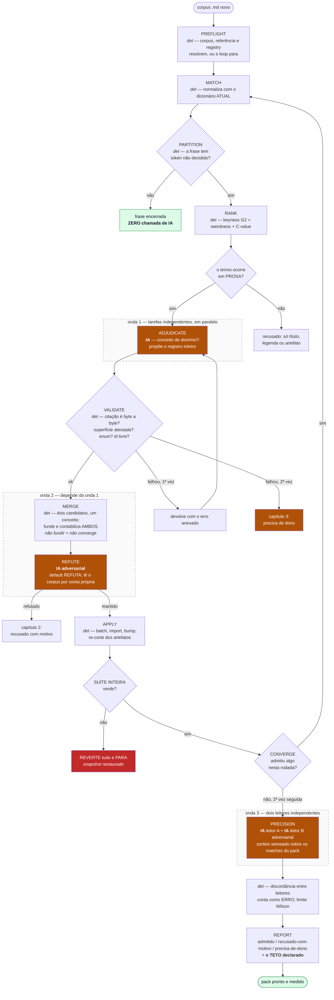
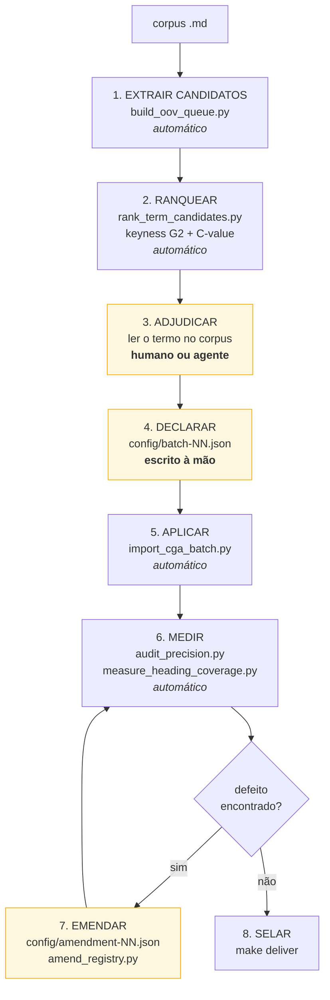

# Como CONSTRUIR um dicionário de domínio

O `README.md` ensina a **usar** o dicionário. Este documento ensina a **construir** um.

A distinção não é acadêmica, e confundi-la é o mal-entendido mais caro sobre esta ferramenta:

```
normalize  →  APLICA um dicionário que já existe.  Instantâneo.
             3.009 segmentos de um livro em ~2 segundos.

construir  →  DECIDE o que entra no dicionário.    Não é instantâneo.
             O pacote CGA custou 47 batches, 68 emendas e
             65 mil caracteres de justificativa escrita à mão.
```

Nenhum passo aqui é feito por IA sozinha, e nenhum é feito por humano sozinho. A máquina **extrai
candidatos e mede consequências**; a pessoa (ou um agente com acesso ao corpus) **adjudica**. É a
divisão que faz o número final significar alguma coisa.

---

## Um comando: `lexicon_pipeline.py`

Os passos manuais abaixo continuam válidos e continuam sendo a explicação de POR QUE cada decisão
existe. Mas eles agora têm um orquestrador que os encadeia, roda os independentes em paralelo e
itera até parar de achar coisa nova:

```bash
python scripts/lexicon_pipeline.py run --run-dir runs/<nome> \
    --domain <dominio> --corpus <dir-com-md> --reference <dir-com-md>
```

O comando avança até onde consegue sozinho e para quando precisa de um nó de IA, saindo com
**código 3** e a lista de tarefas pendentes. Um driver (sessão de agente, pessoa, ou um adaptador
de API) responde as tarefas e re-invoca o mesmo comando. O estado inteiro vive em disco.

```
PREFLIGHT   [det]     corpus e referência resolvem, registry carrega, ou o loop para
MATCH       [det]     normaliza o corpus com o dicionário ATUAL
PARTITION   [det]     por frase: coberta / decidida / pendente — coberta NÃO custa IA
RANK        [det]     ATE: keyness G2 + piso de weirdness + C-value
ADJUDICATE  [modelo]  é conceito de domínio? propõe o registro inteiro
REFUTE      [modelo]  revisor adversarial, default REFUTA; proposta tem de sobreviver
VALIDATE    [det]     citação conferida byte a byte, enums, colisões, atestação em prosa
APPLY       [det]     batch -> config/, import, bump, SUÍTE INTEIRA — vermelho REVERTE
MEASURE     [det]     cobertura e contabilidade de decisões por rodada
CONVERGE    [det]     volta ao MATCH até a fila secar (ou 2 rodadas sem admissão)
PRECISION   [modelo×2] sorteio semeado, dois leitores independentes, limite Wilson
REPORT      [det]     3 capítulos: admitido / recusado-com-motivo / precisa-de-dono
```

**A iteração é Newton-Raphson, com uma ressalva que muda o critério de parada.** Cada rodada
reduz o resíduo — as frases de prosa que ainda têm token não decidido. Newton converge para a raiz
de uma função contínua e para quando o resíduo cai abaixo da tolerância; aqui o ponto fixo é
discreto ("uma rodada inteira não admitiu nada"). A armadilha é que o resíduo pode ir a zero por
dois motivos opostos: o corpus está coberto, ou os filtros estão estritos demais e a fila secou —
o análogo de Newton travando num ponto estacionário. Por isso o `REPORT` publica o **teto**: a
lista dos tokens que sobraram e o motivo de cada recusa. Convergir com teto declarado é honesto;
convergir e chamar de 100% seria a métrica medindo a si mesma.

### O grafo



**Laranja = nó de IA. Vermelho = fail-closed. Verde = terminou sem custar IA.**

### Quando a IA NÃO é chamada

A pergunta que o desenho responde: *frase que já bate no dicionário precisa de IA?* **Não.** E a
unidade de trabalho do modelo não é a frase, é o **termo** — uma decisão sobre `raciocínio` encerra
as 146 frases onde ele aparece. Medido na rodada 1 sobre o livro de reasoning:

| | frases de prosa | com conceito | sem token indeciso | pendentes |
|---|---|---|---|---|
| início da rodada 1 | 2.655 | 3 | 1.001 | 1.651 |

As 1.001 frases sem token indeciso são frases inteiramente de vocabulário comum: já decididas, não
voltam. As 3 com conceito vieram de `core` — o pack compartilhado — **antes de qualquer rodada de
IA**, que é a economia se acumulando entre corpora.

### O contrato IA↔código: proposta, nunca escrita

O modelo nunca escreve no registry. A fronteira é um protocolo de arquivo:

```
<run-dir>/rounds/NN/tasks/pending/<id>.json    o que decidir (auto-contido)
<run-dir>/rounds/NN/tasks/results/<id>.json    o que o modelo decidiu
```

Tudo que volta passa pelo `VALIDATE` antes de tocar o estado. Os gates que já barraram coisa de
verdade:

- **citação verbatim** — `pos_pt` tem de ser substring exata da PROSA do corpus (título e legenda
  não contam). Citação inventada não entra;
- **superfície atestada** — cada grafia proposta tem de ocorrer no corpus;
- **o termo tem de ser decidido** — se o conceito proposto não cobre o candidato, a proposta é
  recusada. Sem isso o loop admitiria conceito e deixaria o termo pendente para sempre;
- **exemplo negativo autorado** — `neg_pt` NÃO pode existir no corpus; se existir, foi copiado;
- **enums do schema**, **id livre**, **autoridade resolve num arquivo do corpus**.

Falhou uma vez: volta ao mesmo nó com o erro anexado. Falhou de novo: vai para o capítulo
"precisa de dono" e o loop segue. Nenhuma decisão de modelo entra sem passar por código.

---

## O que a máquina resolve, e o que ela não resolve

Rode o extrator num corpus novo e veja o que ele devolve. Este é o resultado real sobre
`REASONING_SKILLS_CONSOLIDATED.md`, um livro sobre raciocínio e vieses cognitivos:

```bash
python scripts/build_oov_queue.py --corpus /caminho/do/corpus --output reports/oov-novo.json
```

```
6.342 termos fora do vocabulário, 23.465 ocorrências

  130  raciocínio     ← vocabulário de domínio
   99  lógica         ← vocabulário de domínio
   92  pensamento     ← vocabulário de domínio
   85  escolha        ← vocabulário de domínio
   83  pensar         ← flexão verbal, provavelmente forma de `pensamento`
   81  problema       ← vocabulário de domínio
   80  simples        ← português comum
   76  pessoas        ← português comum
   68  argumento      ← vocabulário de domínio
   63  duas           ← português comum
   62  três           ← português comum
   57  tempo          ← português comum
   54  viés           ← vocabulário de domínio
```

A lista vem ordenada por frequência e **mistura os dois** — a frequência BRUTA não sabe a diferença
entre `viés` (54) e `tempo` (57).

> **Correção.** Uma versão anterior deste documento dizia que *nenhuma estatística* separa os dois e
> concluía que toda adjudicação é manual. **Isso é falso.** A frequência CONTRASTIVA separa, e é a
> técnica fundacional de Automatic Term Extraction — `weirdness` em Ahmad et al., `keyness` em
> linguística de corpus, embarcada no Termostat e no Sketch Engine desde os anos 90. Medido sobre os
> dois corpora deste repo: `pensamento` 4356x, `argumento` 3689x, `falácia` 3111x, `raciocínio` 172x,
> `premissa` 24x, **`viés` 18,7x** — contra `pessoas` 7,1x, `simples` 5,9x, `três` 4,9x, `duas` 3,3x,
> **`tempo` 2,5x**. Uma ordem de grandeza separa exatamente os dois casos que eu usei para dizer que
> era impossível.
>
> Use **`scripts/rank_term_candidates.py`** ANTES de adjudicar. Ele ranqueia por G2 de Dunning
> (significância) com piso de weirdness (tamanho de efeito) e C-value de Frantzi & Ananiadou para
> multi-palavra. Adjudicar continua sendo humano; o que muda é começar de uma lista ranqueada com o
> vocabulário comum empurrado para baixo, em vez de uma pilha onde `viés` e `tempo` parecem iguais.

O que continua verdadeiro: a máquina RANQUEIA, ela não DECIDE. Três tentativas de fazer a máquina
decidir falharam neste repositório, cada uma documentada no cabeçalho de
`scripts/score_term_specificity.py`:

1. **Contar sentidos no OpenWordnet-PT.** Verbo flexionado não está em índice de lemas, então
   `vamos`, `permitem`, `devemos` e `negociadas` voltaram com zero sentidos e foram classificados
   como vocabulário de domínio.
2. **Adicionar morfologia à mão.** Desfez plurais e conjugação regular, e continuou errando em
   `faz`, `têm`, `vamos`. Cada rodada de regex movia o erro em vez de removê-lo.
3. **Entropia de contexto** — medir a concentração das palavras vizinhas, sem wordnet e sem
   morfologia. Backtestado contra termos sabidamente de domínio e sabidamente comuns; se não
   separasse, o script se declara inutilizável em vez de dar um veredito.

A terceira ainda é a melhor ferramenta de TRIAGEM disponível, e é isso que ela é: triagem. O
`scripts/score_term_specificity.py` ordena a fila; ele não decide.

---

## O pipeline, com os comandos reais



Os três blocos amarelos são os que exigem julgamento. Todo o resto é comando.

### 1. Extrair candidatos

```bash
python scripts/build_oov_queue.py --corpus ../meu-corpus --output reports/oov-queue.json
```

Devolve três estratos: `unknown` (candidatos reais), `function` (palavras funcionais, ignorar) e
`ambiguous` (superfícies que já colidem com o registry — atenção redobrada).

### 2. Ranquear — termhood e unithood, método padrão de ATE

```bash
python scripts/rank_term_candidates.py \
  --corpus <dir-alvo> --reference <dir-referencia> --output reports/ranked.json
```

`keyness` por log-likelihood G2 (Dunning 1993) para termhood; `C-value` (Frantzi & Ananiadou) para
unithood de multi-palavra, descontando o candidato pelo quanto ele aparece aninhado em candidatos
maiores. Duas coisas que a literatura já resolveu e o script trata:

- **G2 sozinho promove palavra funcional** — ele mede significância e premia frequência bruta
  (`não` saiu com G2=152 acima de `lógica` com G2=144). Exige-se um piso de weirdness junto, porque
  as duas estatísticas respondem perguntas diferentes.
- **O corpus de referência é uma decisão** — o ideal é geral e balanceado; usar outro domínio
  responde "o que distingue estes dois", que é outra pergunta. O script declara qual usou.

`scripts/score_term_specificity.py` segue disponível como triagem alternativa por entropia de
contexto, e recusa dar veredito se o Youden ficar abaixo de 0,5.

### 3. Adjudicar — o trabalho de verdade

Para cada candidato, LEIA as ocorrências no corpus. A fila já traz citações. Três perguntas:

1. **É um conceito ou uma palavra?** `viés` é um conceito do domínio; `tempo` é uma palavra.
2. **Está atestado em PROSA?** A regra de admissão deste projeto: um termo entra apenas quando o
   conceito é atestado independentemente — já no registry, ou **definido na prosa** — e **nunca por
   aparecer só num título**. Ela recusou `RF` (22 ocorrências, todas em heading) e
   `compra de contrato futuro` (as duas "ocorrências em prosa" eram legenda de imagem).
3. **A superfície é ambígua?** Se duas leituras cabem, a forma nasce `policy: review` e nunca
   dispara sozinha. `deve` é obrigação ou necessidade lógica — fica em review, para sempre.

**Conte antes de decidir.** A regra dos 50 %: se a forma está errada em metade das ocorrências ou
mais, ela é rebaixada; abaixo disso, ela fica automática e as colocações erradas são proibidas.
Contar é obrigatório porque o resultado é contraintuitivo — `recompra` estava errada em 5 de 12
(42 %), o que é a regra de PROIBIR, não a de rebaixar.

### 4. Declarar o batch

Um arquivo por lote, em `config/`:

```json
{
  "batch": 48,
  "corpus_sha256": "<hash do corpus>",
  "adjudication_note": "Por que estes termos, e principalmente POR QUE OS RECUSADOS foram recusados. Este campo é o registro da adjudicação — um batch sem ele é um número sem procedência.",
  "concepts": [
    {
      "id": "technical.cognitive_bias",
      "en": "cognitive bias",
      "pt": "viés cognitivo",
      "class": "technical_term",
      "pos": "noun",
      "def": "Desvio sistemático do julgamento que distorce a percepção sem que a pessoa perceba.",
      "alt_en": ["cognitive biases"],
      "alt_pt": ["viés", "vieses cognitivos", "vieses"],
      "authority": "reasoning-skills#capitulo-2"
    }
  ]
}
```

`semantic_class` válidos: `actor`, `action`, `entity`, `modality`, `polarity`, `condition_marker`,
`temporal_marker`, `quantity_marker`, `risk`, `technical_term`. O `contexts` do registro sai do
domínio que você declarar — use um nome novo (`reasoning`) e o pacote fica isolado do CGA.

### 5. Aplicar

```bash
python scripts/import_cga_batch.py --batch config/batch-48.json --registry-version 2.37.0
```

**Passe sempre `--registry-version`.** O default é `2.2.0` e ele reescreve a versão de TODOS os
registros — foi assim que 573 registros foram carimbados quatro versões atrás numa sessão.

**Leia a saída, não só o exit code.** O importador imprime `demoted_to_review` quando o demovedor de
colisão dispara. Foi lendo essa linha que um conceito `technical.reprisk_index` duplicado foi pego
antes de custar ao incumbente a forma automática dele.

### 6. Medir

```bash
python scripts/audit_precision.py            # TODA ocorrência de TODA forma, com contexto
python scripts/sample_unread_residual.py --queues reports/sweep-queue.json \
       --output reports/residual.json --sample 240 --seed <seed>
python scripts/report_precision.py           # limite Wilson a partir do sorteio adjudicado
python scripts/measure_heading_coverage.py   # cobertura contra os títulos do próprio corpus
python scripts/cut_coverage_ceiling.py       # o que sobrou, e por que cada item foi recusado
```

O `report_precision.py` **recusa** publicar se o sorteio foi feito contra outra versão do registry,
e recusa de novo se o sorteio não tem `adjudicated_errors`. Um número calculado sobre amostra não
lida seria ficção, e o script diz isso.

Ler os 240 eventos é seu. Não há atalho: foi lendo amostra que apareceu `ativo em` disparando em
`ativo em relação a`, e foi lendo contexto ao redor de registros novos que apareceu `multimercado`
reescrevendo a categoria formal da CVM para `hedge fund`. **Amostra aleatória mede a TAXA; leitura
dirigida acha o DEFEITO RARO.** Uma não substitui a outra.

### 7. Emendar

Defeito encontrado vira emenda, nunca edição manual do `registry.jsonl` — o `build_release.py`
recusa um registry editado à mão, e o guard de proveniência recusa um encolhimento não declarado.

```json
{
  "id": "amendment-69",
  "corpus_sha256": "<hash>",
  "method": "como foi medido",
  "reason": "O QUE deu errado, COMO foi diagnosticado, e por que esta correção e não outra.",
  "operations": [
    {"op": "remove_form", "concept": "...", "language": "pt-BR", "form": "...", "wrong": 5, "total": 12, "why": "..."}
  ]
}
```

Operações: `add_concept`, `add_form`, `remove_form`, `promote`, `demote`, `rename_pref`,
`redefine`, `forbid`, `unforbid`.

**Um id de emenda já aplicado é no-op silencioso.** A emenda 63 imprimiu `forms_removed: 1` e não
mudou nada no disco; só foi pego com `grep` no registry. Reemita sob id novo.

### 8. Selar

```bash
make deliver     # valida, recorta o manifesto, roda a suíte, confere que os três concordam
```

---

## Exemplo completo: um pacote `reasoning` do zero

Medições reais do corpus do usuário, `REASONING_SKILLS_CONSOLIDATED.md` (4.950 linhas):

**Ponto de partida — o que o pacote CGA já cobre desse livro:**

```bash
semantic-normalizer normalize REASONING_SKILLS_CONSOLIDATED.md --contexts core cga > book.jsonl
```

```
3.009 segmentos, 1.127 com ao menos um conceito (37,5 %)
102 conceitos distintos acionados, de 519 carregados
```

Parece cobertura razoável — **e não é**. Olhe o que disparou:

```
454  polarity.negation      ← core, agnóstico de domínio
308  action.decide          ← core
199  condition.when         ← core
168  polarity.absence       ← core
111  entity.premise         ← core
 98  technical.option       ← FINANCEIRO. "opção" no livro significa alternativa,
                              não instrumento derivativo. FALSO POSITIVO.
 84  actor.company          ← genérico
```

Os operadores `core` funcionam em qualquer domínio, como foram projetados. O conteúdo financeiro
não funciona: `technical.option` disparando 98 vezes num livro sobre raciocínio é a colisão de
sentido que o escopo de domínio existe para evitar — e que aconteceria **de verdade** se o pacote de
raciocínio fosse fundido na mesma tabela do CGA.

**O que um pacote `reasoning` precisaria:** 6.342 candidatos, 23.465 ocorrências. Adjudicados, os
primeiros conceitos seriam `raciocínio`, `lógica`, `pensamento`, `argumento`, `premissa`,
`conclusão`, `viés cognitivo`, `falácia`, `heurística`, `dedução`, `indução`, `abdução`,
`analogia`, `MECE`, `matriz de decisão`.

**Quanto custa:** o pacote CGA cobriu seu corpus com 498 conceitos ao longo de 47 batches. Um lote
de 12 conceitos bem adjudicados — ler as ocorrências, contar as erradas, escrever a justificativa —
é o tamanho típico de um batch neste repositório.

**O que o pipeline mediu de verdade neste corpus.** Quatro rodadas, orçamento fechado antes do
resultado da última, sobre `REASONING_SKILLS_CONSOLIDATED.md`:

| | |
|---|---|
| candidatos que chegaram a um nó de IA | 96 (24 por rodada) |
| recusados só por estatística + regra de prosa, sem IA | 6 (`no-prose-attestation`) |
| propostas que passaram o validador determinístico | 23 |
| **derrubadas pelo nó adversarial** | **9 — 39 %** |
| conceitos que entraram no registry | 14 (15 superfícies; `argumento`/`argumentos` fundidos) |
| recusados com motivo registrado | 87 |
| precisam de dono humano | 0 |
| precisão: eventos sorteados, lidos por 2 leitores | 60 de 695 · 55 concordam correto · Wilson 0,8193 |

Os 39 % derrubados são a razão de o nó adversarial existir. Ele leu o corpus por conta própria,
além das citações que recebeu: matou `decisão` porque a definição descrevia a tese normativa do
autor e não o sentido das 368 ocorrências; matou `trair` porque quatro das seis citações eram
substring dentro de `extrair`/`atrair` — defeito do PIPELINE, não do batch, e foi assim que ele foi
encontrado; e matou `heurísticas` porque o corpus declara dois tipos e a definição cobria um.

---

## O que é automático e o que não é

| etapa | automático? |
|---|---|
| extrair candidatos | **sim** — `build_oov_queue.py` |
| ranquear por termhood/unithood | **sim** — `rank_term_candidates.py`, ATE portado |
| decidir se um termo é conceito | **não** |
| decidir se a superfície é ambígua | **não** |
| contar quantas ocorrências estão erradas | **não** — ler é o método |
| escrever a definição e a autoridade | **não** |
| aplicar o batch | **sim** — `import_cga_batch.py` |
| detectar colisão de superfície | **sim** — o demovedor, mas você tem de LER a saída |
| medir precisão e cobertura | **sim** — e os scripts recusam medir sobre amostra não lida |
| decidir o que fazer com um defeito | **não** |
| selar o release | **sim** — `make deliver` |

Uma IA pode fazer a coluna "não" — foi assim que este registry foi construído. Mas ela faz **lendo o
corpus e escrevendo a justificativa**, não gerando o dicionário de um comando. A justificativa é o
produto tanto quanto o conceito: 65 mil caracteres dela estão em `config/`, e é o que permite
alguém, depois, verificar se a decisão foi boa.

## Erros que este repositório cometeu, para você não repetir

Cada um está documentado na emenda que o corrigiu:

- **Um conceito com dois sentidos OPOSTOS.** `technical.option` tinha put E call, com call como
  preferida — todo put do corpus virava call na reescrita. Um conceito reúne muitas GRAFIAS de um
  sentido; nunca dois sentidos contrários.
- **Rótulo preferido que não é o lema.** `technical.material_information` nasceu com pref
  `Informações Relevantes` (plural, copiado de um título) enquanto as 8 ocorrências são singular. O
  pref é o que a reescrita substitui — se não é o lema, ele reescreve errado sempre.
- **Falso amigo entre idiomas.** `multimercado` estava em `technical.hedge_fund`; no corpus é a
  categoria formal da CVM. A reescrita injetava `hedge fund` em texto regulatório brasileiro.
- **Forma nua ambígua demais.** `ativo em` (perna de swap) disparava em `ativo em relação a`. 2 de 2
  erradas. As formas qualificadas — `ativo em dólar`, `ativo em prefixado` — cobrem os casos reais.
- **Anchor de autoridade inventada.** 50 conceitos citavam capítulos que não existiam no corpus.
  Citação que não resolve lê como verificada e não é. `scripts/fix_authority_anchors.py` deriva a
  âncora de onde o termo realmente ocorre.
- **Guard testado só no verde.** Um teste de regressão foi escrito, passou, e comparava a função com
  ela mesma. Todo guard novo tem de ser CANARIADO: quebre de propósito o que ele deveria pegar e
  confirme que ele falha.
