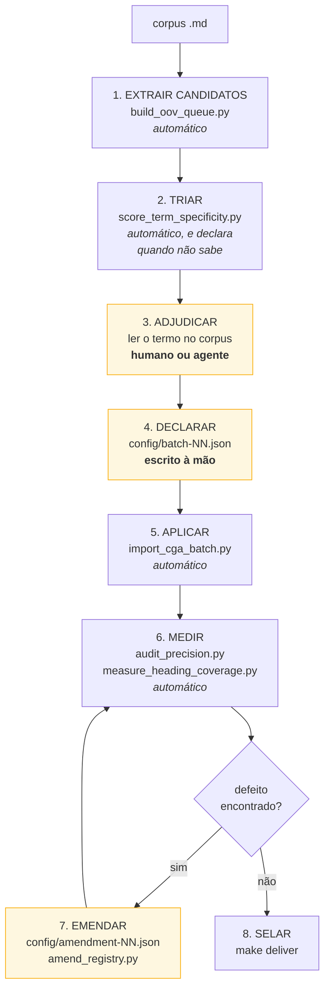

# Como CONSTRUIR um dicionário de domínio

O `README.md` ensina a **usar** o dicionário. Este documento ensina a **construir** um.

A distinção não é acadêmica, e confundi-la é o mal-entendido mais caro sobre esta ferramenta:

```
normalize  →  APLICA um dicionário que já existe.  Instantâneo.
             3.009 segmentos de um livro em ~2 segundos.

construir  →  DECIDE o que entra no dicionário.    Não é instantâneo.
             O pacote CGA custou 47 batches, 68 emendas e
             65 mil caracteres de justificativa escrita à mão.
```

Nenhum passo aqui é feito por IA sozinha, e nenhum é feito por humano sozinho. A máquina **extrai
candidatos e mede consequências**; a pessoa (ou um agente com acesso ao corpus) **adjudica**. É a
divisão que faz o número final significar alguma coisa.

---

## Por que a adjudicação não pode ser automatizada

Rode o extrator num corpus novo e veja o que ele devolve. Este é o resultado real sobre
`REASONING_SKILLS_CONSOLIDATED.md`, um livro sobre raciocínio e vieses cognitivos:

```bash
python scripts/build_oov_queue.py --corpus /caminho/do/corpus --output reports/oov-novo.json
```

```
6.342 termos fora do vocabulário, 23.465 ocorrências

  130  raciocínio     ← vocabulário de domínio
   99  lógica         ← vocabulário de domínio
   92  pensamento     ← vocabulário de domínio
   85  escolha        ← vocabulário de domínio
   83  pensar         ← flexão verbal, provavelmente forma de `pensamento`
   81  problema       ← vocabulário de domínio
   80  simples        ← português comum
   76  pessoas        ← português comum
   68  argumento      ← vocabulário de domínio
   63  duas           ← português comum
   62  três           ← português comum
   57  tempo          ← português comum
   54  viés           ← vocabulário de domínio
```

A lista vem ordenada por frequência e **mistura os dois**. Nenhuma estatística separa `viés` (54
ocorrências, conceito central do livro) de `tempo` (57 ocorrências, palavra comum). A frequência não
sabe a diferença; o significado sabe.

Este repositório tentou automatizar essa separação **três vezes** e as três falharam, cada uma
documentada no cabeçalho de `scripts/score_term_specificity.py`:

1. **Contar sentidos no OpenWordnet-PT.** Verbo flexionado não está em índice de lemas, então
   `vamos`, `permitem`, `devemos` e `negociadas` voltaram com zero sentidos e foram classificados
   como vocabulário de domínio.
2. **Adicionar morfologia à mão.** Desfez plurais e conjugação regular, e continuou errando em
   `faz`, `têm`, `vamos`. Cada rodada de regex movia o erro em vez de removê-lo.
3. **Entropia de contexto** — medir a concentração das palavras vizinhas, sem wordnet e sem
   morfologia. Backtestado contra termos sabidamente de domínio e sabidamente comuns; se não
   separasse, o script se declara inutilizável em vez de dar um veredito.

A terceira ainda é a melhor ferramenta de TRIAGEM disponível, e é isso que ela é: triagem. O
`scripts/score_term_specificity.py` ordena a fila; ele não decide.

---

## O pipeline, com os comandos reais



Os três blocos amarelos são os que exigem julgamento. Todo o resto é comando.

### 1. Extrair candidatos

```bash
python scripts/build_oov_queue.py --corpus ../meu-corpus --output reports/oov-queue.json
```

Devolve três estratos: `unknown` (candidatos reais), `function` (palavras funcionais, ignorar) e
`ambiguous` (superfícies que já colidem com o registry — atenção redobrada).

### 2. Triar

```bash
python scripts/score_term_specificity.py --queue reports/oov-queue.json
```

Calcula a entropia de contexto de cada termo e **backtesta contra termos que você já sabe** serem de
domínio e comuns. Se o índice de Youden ficar abaixo de 0,5, o script diz que não sabe separar e
recusa dar veredito. Isso é uma resposta legítima e melhor do que um palpite com cara de medida.

### 3. Adjudicar — o trabalho de verdade

Para cada candidato, LEIA as ocorrências no corpus. A fila já traz citações. Três perguntas:

1. **É um conceito ou uma palavra?** `viés` é um conceito do domínio; `tempo` é uma palavra.
2. **Está atestado em PROSA?** A regra de admissão deste projeto: um termo entra apenas quando o
   conceito é atestado independentemente — já no registry, ou **definido na prosa** — e **nunca por
   aparecer só num título**. Ela recusou `RF` (22 ocorrências, todas em heading) e
   `compra de contrato futuro` (as duas "ocorrências em prosa" eram legenda de imagem).
3. **A superfície é ambígua?** Se duas leituras cabem, a forma nasce `policy: review` e nunca
   dispara sozinha. `deve` é obrigação ou necessidade lógica — fica em review, para sempre.

**Conte antes de decidir.** A regra dos 50 %: se a forma está errada em metade das ocorrências ou
mais, ela é rebaixada; abaixo disso, ela fica automática e as colocações erradas são proibidas.
Contar é obrigatório porque o resultado é contraintuitivo — `recompra` estava errada em 5 de 12
(42 %), o que é a regra de PROIBIR, não a de rebaixar.

### 4. Declarar o batch

Um arquivo por lote, em `config/`:

```json
{
  "batch": 48,
  "corpus_sha256": "<hash do corpus>",
  "adjudication_note": "Por que estes termos, e principalmente POR QUE OS RECUSADOS foram recusados. Este campo é o registro da adjudicação — um batch sem ele é um número sem procedência.",
  "concepts": [
    {
      "id": "technical.cognitive_bias",
      "en": "cognitive bias",
      "pt": "viés cognitivo",
      "class": "technical_term",
      "pos": "noun",
      "def": "Desvio sistemático do julgamento que distorce a percepção sem que a pessoa perceba.",
      "alt_en": ["cognitive biases"],
      "alt_pt": ["viés", "vieses cognitivos", "vieses"],
      "authority": "reasoning-skills#capitulo-2"
    }
  ]
}
```

`semantic_class` válidos: `actor`, `action`, `entity`, `modality`, `polarity`, `condition_marker`,
`temporal_marker`, `quantity_marker`, `risk`, `technical_term`. O `contexts` do registro sai do
domínio que você declarar — use um nome novo (`reasoning`) e o pacote fica isolado do CGA.

### 5. Aplicar

```bash
python scripts/import_cga_batch.py --batch config/batch-48.json --registry-version 2.37.0
```

**Passe sempre `--registry-version`.** O default é `2.2.0` e ele reescreve a versão de TODOS os
registros — foi assim que 573 registros foram carimbados quatro versões atrás numa sessão.

**Leia a saída, não só o exit code.** O importador imprime `demoted_to_review` quando o demovedor de
colisão dispara. Foi lendo essa linha que um conceito `technical.reprisk_index` duplicado foi pego
antes de custar ao incumbente a forma automática dele.

### 6. Medir

```bash
python scripts/audit_precision.py            # TODA ocorrência de TODA forma, com contexto
python scripts/sample_unread_residual.py --queues reports/sweep-queue.json \
       --output reports/residual.json --sample 240 --seed <seed>
python scripts/report_precision.py           # limite Wilson a partir do sorteio adjudicado
python scripts/measure_heading_coverage.py   # cobertura contra os títulos do próprio corpus
python scripts/cut_coverage_ceiling.py       # o que sobrou, e por que cada item foi recusado
```

O `report_precision.py` **recusa** publicar se o sorteio foi feito contra outra versão do registry,
e recusa de novo se o sorteio não tem `adjudicated_errors`. Um número calculado sobre amostra não
lida seria ficção, e o script diz isso.

Ler os 240 eventos é seu. Não há atalho: foi lendo amostra que apareceu `ativo em` disparando em
`ativo em relação a`, e foi lendo contexto ao redor de registros novos que apareceu `multimercado`
reescrevendo a categoria formal da CVM para `hedge fund`. **Amostra aleatória mede a TAXA; leitura
dirigida acha o DEFEITO RARO.** Uma não substitui a outra.

### 7. Emendar

Defeito encontrado vira emenda, nunca edição manual do `registry.jsonl` — o `build_release.py`
recusa um registry editado à mão, e o guard de proveniência recusa um encolhimento não declarado.

```json
{
  "id": "amendment-69",
  "corpus_sha256": "<hash>",
  "method": "como foi medido",
  "reason": "O QUE deu errado, COMO foi diagnosticado, e por que esta correção e não outra.",
  "operations": [
    {"op": "remove_form", "concept": "...", "language": "pt-BR", "form": "...", "wrong": 5, "total": 12, "why": "..."}
  ]
}
```

Operações: `add_concept`, `add_form`, `remove_form`, `promote`, `demote`, `rename_pref`,
`redefine`, `forbid`, `unforbid`.

**Um id de emenda já aplicado é no-op silencioso.** A emenda 63 imprimiu `forms_removed: 1` e não
mudou nada no disco; só foi pego com `grep` no registry. Reemita sob id novo.

### 8. Selar

```bash
make deliver     # valida, recorta o manifesto, roda a suíte, confere que os três concordam
```

---

## Exemplo completo: um pacote `reasoning` do zero

Medições reais do corpus do usuário, `REASONING_SKILLS_CONSOLIDATED.md` (4.950 linhas):

**Ponto de partida — o que o pacote CGA já cobre desse livro:**

```bash
semantic-normalizer normalize REASONING_SKILLS_CONSOLIDATED.md --contexts core cga > book.jsonl
```

```
3.009 segmentos, 1.127 com ao menos um conceito (37,5 %)
102 conceitos distintos acionados, de 519 carregados
```

Parece cobertura razoável — **e não é**. Olhe o que disparou:

```
454  polarity.negation      ← core, agnóstico de domínio
308  action.decide          ← core
199  condition.when         ← core
168  polarity.absence       ← core
111  entity.premise         ← core
 98  technical.option       ← FINANCEIRO. "opção" no livro significa alternativa,
                              não instrumento derivativo. FALSO POSITIVO.
 84  actor.company          ← genérico
```

Os operadores `core` funcionam em qualquer domínio, como foram projetados. O conteúdo financeiro
não funciona: `technical.option` disparando 98 vezes num livro sobre raciocínio é a colisão de
sentido que o escopo de domínio existe para evitar — e que aconteceria **de verdade** se o pacote de
raciocínio fosse fundido na mesma tabela do CGA.

**O que um pacote `reasoning` precisaria:** 6.342 candidatos, 23.465 ocorrências. Adjudicados, os
primeiros conceitos seriam `raciocínio`, `lógica`, `pensamento`, `argumento`, `premissa`,
`conclusão`, `viés cognitivo`, `falácia`, `heurística`, `dedução`, `indução`, `abdução`,
`analogia`, `MECE`, `matriz de decisão`.

**Quanto custa:** o pacote CGA cobriu seu corpus com 498 conceitos ao longo de 47 batches. Um lote
de 12 conceitos bem adjudicados — ler as ocorrências, contar as erradas, escrever a justificativa —
é o tamanho típico de um batch neste repositório.

---

## O que é automático e o que não é

| etapa | automático? |
|---|---|
| extrair candidatos | **sim** — `build_oov_queue.py` |
| triar por especificidade | **sim**, com backtest — e declara quando não sabe |
| decidir se um termo é conceito | **não** |
| decidir se a superfície é ambígua | **não** |
| contar quantas ocorrências estão erradas | **não** — ler é o método |
| escrever a definição e a autoridade | **não** |
| aplicar o batch | **sim** — `import_cga_batch.py` |
| detectar colisão de superfície | **sim** — o demovedor, mas você tem de LER a saída |
| medir precisão e cobertura | **sim** — e os scripts recusam medir sobre amostra não lida |
| decidir o que fazer com um defeito | **não** |
| selar o release | **sim** — `make deliver` |

Uma IA pode fazer a coluna "não" — foi assim que este registry foi construído. Mas ela faz **lendo o
corpus e escrevendo a justificativa**, não gerando o dicionário de um comando. A justificativa é o
produto tanto quanto o conceito: 65 mil caracteres dela estão em `config/`, e é o que permite
alguém, depois, verificar se a decisão foi boa.

## Erros que este repositório cometeu, para você não repetir

Cada um está documentado na emenda que o corrigiu:

- **Um conceito com dois sentidos OPOSTOS.** `technical.option` tinha put E call, com call como
  preferida — todo put do corpus virava call na reescrita. Um conceito reúne muitas GRAFIAS de um
  sentido; nunca dois sentidos contrários.
- **Rótulo preferido que não é o lema.** `technical.material_information` nasceu com pref
  `Informações Relevantes` (plural, copiado de um título) enquanto as 8 ocorrências são singular. O
  pref é o que a reescrita substitui — se não é o lema, ele reescreve errado sempre.
- **Falso amigo entre idiomas.** `multimercado` estava em `technical.hedge_fund`; no corpus é a
  categoria formal da CVM. A reescrita injetava `hedge fund` em texto regulatório brasileiro.
- **Forma nua ambígua demais.** `ativo em` (perna de swap) disparava em `ativo em relação a`. 2 de 2
  erradas. As formas qualificadas — `ativo em dólar`, `ativo em prefixado` — cobrem os casos reais.
- **Anchor de autoridade inventada.** 50 conceitos citavam capítulos que não existiam no corpus.
  Citação que não resolve lê como verificada e não é. `scripts/fix_authority_anchors.py` deriva a
  âncora de onde o termo realmente ocorre.
- **Guard testado só no verde.** Um teste de regressão foi escrito, passou, e comparava a função com
  ela mesma. Todo guard novo tem de ser CANARIADO: quebre de propósito o que ele deveria pegar e
  confirme que ele falha.
