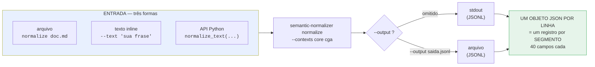
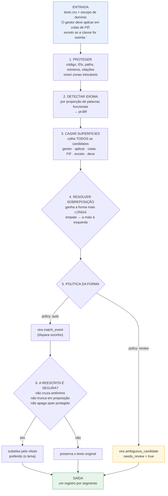
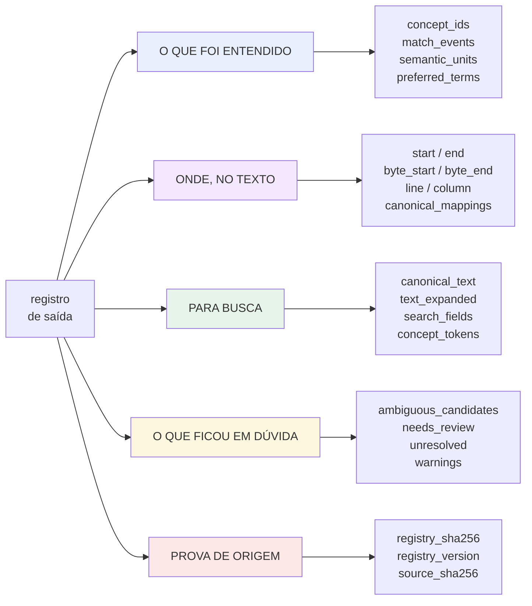
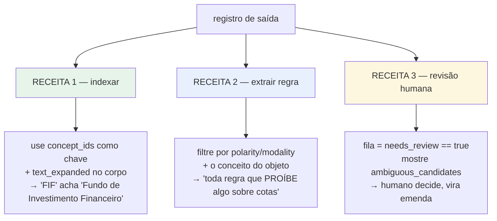
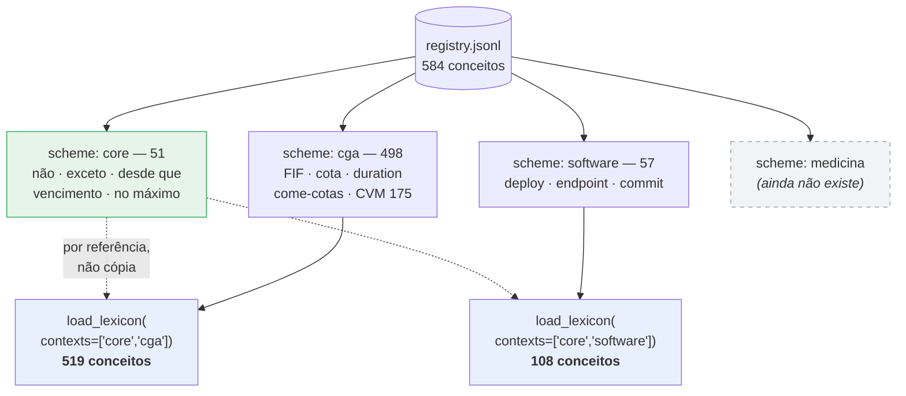

# semantic-normalizer

A governed bilingual (pt-BR / en) **concept registry** and a deterministic **text normalizer** built
on it. You give it prose; it tells you which concepts the prose refers to, where each one starts and
ends, and what the sentence looks like once every recognised surface is rewritten to its canonical
form.

It is not an embedding model and not an LLM. It is a dictionary with a matcher, and every answer is
reproducible from the registry hash.

The shipped registry covers the **CGA/ANBIMA** Brazilian financial-certification domain — 584
concepts, measured against a 12-file course corpus.


> ### Construir vs. usar
>
> Este README ensina a **usar** o dicionário. Para **construir** um — para um domínio novo, ou para
> estender este — leia **[BUILDING.md](BUILDING.md)**, e rode:
>
> ```bash
> python scripts/lexicon_pipeline.py run --run-dir runs/<nome> \
>     --domain <dominio> --corpus <dir-com-md> --reference <dir-com-md>
> ```
>
> A distinção importa: `normalize` APLICA um dicionário existente e é instantâneo (3.009 segmentos
> de um livro em ~2 s). CONSTRUIR o dicionário não é: o pacote CGA custou 47 batches, 68 emendas e
> 65 mil caracteres de justificativa escrita à mão, tudo versionado em `config/`.
>
> O `lexicon_pipeline.py` é o orquestrador dessa construção — 9 fases determinísticas, 3 nós de IA
> (adjudicar, refutar adversarialmente, ler para precisão) e um laço que itera até parar de achar
> coisa nova. A extração e o ranqueamento de candidatos são automáticos (ATE: keyness G2 +
> C-value); a **adjudicação é um nó de IA cuja saída passa inteira por um validador determinístico**
> — citação conferida byte a byte contra a prosa do corpus, atestação de cada grafia, enums do
> schema. Nada que um modelo devolve entra sem passar por código, e o `APPLY` roda a suíte completa
> e **reverte** se ela ficar vermelha. Três tentativas antigas de automatizar a adjudicação com
> estatística pura estão documentadas como fracassos no cabeçalho de
> `scripts/score_term_specificity.py`; o que mudou não foi a estatística, foi ter um nó que LÊ o
> corpus e um segundo nó que tenta derrubá-lo.


---

## Where the ontology lives

```
src/semantic_normalizer/data/
  registry.jsonl            ← THE ONTOLOGY. one JSON object per concept, 584 lines
  registry.schema.json      ← the closed schema every record must satisfy
  registry.release.json     ← version + sha256 of every shipped file
  registry.provenance.jsonl ← append-only ledger: every batch and amendment ever applied
```

`registry.jsonl` is the artifact. Everything else in this repo either builds it, measures it, or
consumes it. One record, abridged:

```json
{
  "concept_id": "entity.financial_investment_fund",
  "definition": "The CVM 175 category covering funds whose portfolio is financial assets…",
  "semantic_class": "entity",
  "contexts": ["cga", "finance"],
  "labels": {
    "pt-BR": {"pref": "Fundo de Investimento Financeiro",
              "alt": ["FIF", "fundos de investimento financeiro"],
              "hidden": [], "observed": []},
    "en":    {"pref": "financial investment fund", "alt": [], "hidden": [], "observed": []}
  },
  "lexical_forms": {
    "pt-BR": [{"form": "FIF", "policy": "auto", "features": {}}, "…"]
  },
  "forbidden_variants": {"pt-BR": [], "en": []},
  "authority": "apostila-cga-2026#04-resolucao-cvm-175-fundos-de-investimento"
}
```

Three fields carry most of the weight:

| field | what it does |
|---|---|
| `policy` on each form | `auto` = the matcher may fire on it unattended. `review` = known-ambiguous, never fires automatically. |
| `labels.*.pref` | the **canonical** surface. This is what a rewrite substitutes, so it must be the lemma, not a heading spelling. |
| `contexts` | which domain packs the concept belongs to. Read at load time — see *Plug-and-play*. |

---

## Quick start

```bash
pip install -e .
make check          # validate registry + rebuild manifest + run the suite
```

```python
from semantic_normalizer import load_lexicon, normalize_text

lex = load_lexicon(contexts=["core", "cga"])
[out] = normalize_text(
    "É vedada a aplicação em cotas de FIF destinadas a investidores qualificados, "
    "exceto se a classe for restrita.",
    source="doc.md", kind="text", lexicon=lex,
)

out["concept_ids"]
# ['polarity.prohibition', 'action.subscribe', 'entity.fund_share',
#  'entity.financial_investment_fund', 'actor.investor', 'polarity.exception']

out["canonical_text"]
# 'É vedada a aplicar cota de Fundo de Investimento Financeiro destinadas a
#  investidor qualificados, exceto se a classe for restrita.'
```

That output is real, not illustrative — it is what the shipped registry produces today.

Two things to notice, because they are the design and not accidents:

- **`FIF` resolved to the full concept.** The acronym and `Fundo de Investimento Financeiro` are one
  concept, so a query for either finds both.
- **`canonical_text` is a LEMMA projection, not publishable prose.** `aplicação em → aplicar`,
  `cotas → cota`. It exists so two spellings of one thing collapse to a single string for indexing;
  `canonical_mappings` carries byte offsets back to the source for every rewrite.

Each record also carries `byte_start` / `byte_end` / `column`, `language`, and `lexicon_sha256`, so a
downstream consumer can prove which registry produced a given annotation.

---

## Na prática: onde entra o texto, onde sai o resultado



### Passo a passo, com um arquivo de verdade

**1. O arquivo de entrada** — qualquer `.md`, `.txt` ou `.py`. Nada precisa ser preparado:

```bash
cat > regra.md <<'EOF'
# Obrigações do gestor

O gestor deve aplicar em cotas de FIF, exceto se a classe for restrita.
É vedada a cobrança de taxa de performance em Fundos de Renda Fixa Simples.
EOF
```

**2. Uma passada:**

```bash
semantic-normalizer normalize regra.md --contexts core cga --output saida.jsonl
```

**3. O que saiu** — `saida.jsonl`, **um objeto JSON por linha**, um registro por segmento de texto:

```
linha  1 | needs_review=False | # Obrigações do gestor
           concepts: ['technical.manager_obligations']

linha  3 | needs_review=True  | O gestor deve aplicar em cotas de FIF, exceto se…
           concepts: ['actor.portfolio_manager', 'action.subscribe',
                      'entity.fund_share', 'entity.financial_investment_fund',
                      'polarity.exception']

linha  4 | needs_review=False | É vedada a cobrança de taxa de performance em…
           concepts: ['polarity.prohibition', 'technical.performance_fee',
                      'entity.fixed_income_fund']
```

Três linhas de entrada → três registros, **40 campos cada**. Essa é a execução real do comando
acima, não um exemplo montado.

### Respondendo direto

| pergunta | resposta |
|---|---|
| **Onde coloco o texto de entrada?** | Passe o **caminho do arquivo** como argumento, ou use `--text "frase"` para uma frase avulsa. Não há leitura de `stdin` — `normalize -` dá erro. |
| **Onde fica a saída?** | No **stdout** por padrão. Com `--output arquivo.jsonl`, no arquivo. O arquivo de entrada nunca é modificado. |
| **É JSON ou JSONL?** | **JSONL** — um objeto por linha. `json.load()` falha; use `[json.loads(l) for l in open(f) if l.strip()]`. |
| **Uma passada já retorna tudo?** | **Sim.** Um passe produz o registro completo — conceitos, offsets, texto canônico, ambiguidades, campos de busca e hashes de proveniência. Não há segunda etapa nem serviço para chamar. |
| **Preciso de rede, API key, GPU?** | Não. É determinístico e offline. A mesma entrada com o mesmo `registry_sha256` dá sempre a mesma saída. |
| **Um registro por arquivo ou por linha?** | Por **segmento** — em markdown, tipicamente uma linha ou parágrafo. Linhas em branco não viram registro. |

### Lendo a saída

```python
import json

recs = [json.loads(line) for line in open("saida.jsonl") if line.strip()]

# tudo que o documento fala sobre, sem duplicar
conceitos = sorted({c for r in recs for c in r["concept_ids"]})

# o que a ferramenta NÃO teve certeza — sua fila de revisão
pendentes = [r for r in recs if r["needs_review"]]

for r in pendentes:
    for amb in r["ambiguous_candidates"]:
        leituras = [c["concept_id"] for c in amb["candidates"]]
        print(f'linha {r["line"]}: "{amb["alias"]}" pode ser {leituras}')
# linha 3: "deve" pode ser ['modality.logical_necessity', 'modality.obligation']
```

### Corpus inteiro

`normalize` processa um arquivo por vez. Para uma pasta, itere — a saída de todos pode ir para o
mesmo `.jsonl`, porque cada registro carrega o próprio `source` e `line`:

```bash
for f in docs/*.md; do
  semantic-normalizer normalize "$f" --contexts core cga >> corpus.jsonl
done
```

Cada registro traz `source`, `line`, `column`, `byte_start`/`byte_end` e `source_sha256` — então um
único `corpus.jsonl` continua rastreável até o arquivo e o byte de origem.

---

## Como funciona: o que entra e o que sai



**Ponto central:** o passo 5 é o que separa esta ferramenta de um find-and-replace. `deve` pode ser
obrigação (`modality.obligation`) ou necessidade lógica (`modality.logical_necessity`). O registry
sabe que a superfície é ambígua, então ela **não dispara sozinha** — sai como candidata, com as duas
leituras, e o registro inteiro é marcado `needs_review: true`. A ferramenta nunca chuta.

### O que sai, campo por campo

O registro tem ~40 campos. Eles se agrupam em cinco propósitos:



#### Glossário dos termos que aparecem na saída

| termo | o que é, em uma frase | exemplo real da execução acima |
|---|---|---|
| **`concept_id`** | A identidade estável do conceito, independente de idioma. É a chave. | `actor.portfolio_manager` |
| **`alias`** | A grafia que apareceu **no texto**. | `gestor`, `FIF`, `cotas` |
| **`match_event`** | Um acerto: qual conceito, em que trecho, por qual grafia. | `{start: 14, end: 21, alias: "aplicar", concept_id: "action.subscribe"}` |
| **`policy: auto`** | Grafia não-ambígua — o matcher pode disparar sozinho. | `FIF` → só significa uma coisa neste domínio |
| **`policy: review`** | Grafia sabidamente ambígua — **nunca** dispara sozinha. | `deve` → obrigação ou necessidade lógica? |
| **`pref`** (rótulo preferido) | A forma **canônica** do conceito. É o que a reescrita substitui, por isso tem de ser o lema. | `Fundo de Investimento Financeiro` |
| **`canonical_text`** | A frase com toda grafia reconhecida trocada pelo `pref`. **Para indexar, não para exibir.** | `…aplicar em cota de Fundo de Investimento Financeiro…` |
| **`canonical_mappings`** | A ponte de volta: cada troca com offset na origem **e** no canônico. | `{original: "cotas", canonical: "cota", original_start: 24…}` |
| **`ambiguous_candidates`** | O que era ambíguo, com **todas** as leituras possíveis e a definição de cada uma. | `deve` → `modality.obligation` **ou** `modality.logical_necessity` |
| **`needs_review`** | `true` se algum trecho ficou ambíguo. Seu gate de automação. | `true` neste exemplo, por causa do `deve` |
| **`unresolved`** | Trechos que nenhum conceito cobriu. Onde procurar vocabulário faltando. | `"O "`, `"deve"`, `"se a "` |
| **`protected`** | Zonas intocáveis: código, IDs, números, paths. Nunca reescritas. | `[]` aqui — a frase não tem nenhum |
| **`text_expanded`** | Texto original **+** todos os sinônimos dos conceitos, colados. Alimento de BM25. | `…restrita. portfolio manager asset manager gestor…` |
| **`search_fields`** | Cinco visões prontas para índice: `raw_exact`, `same_language_terms`, `cross_language_terms`, `concept_terms`, `ascii_fallback` | — |
| **`semantic_units`** + **`semantic_relations`** | Os conceitos como nós, e as relações entre eles (`actor_of`, etc.). | `u1 = actor.portfolio_manager`, papel `actor` |
| **`registry_sha256`** | Hash do dicionário que produziu esta anotação. Sem ele o resultado não é reprodutível. | `9f1f19ca…` |

---

## Como usar a saída: três receitas



### Receita 1 — busca que sobrevive à paráfrase

```python
from semantic_normalizer import load_lexicon, normalize_text
lex = load_lexicon(contexts=["core", "cga"])

def index_entry(doc_id, text):
    recs = normalize_text(text, source=doc_id, kind="text", lexicon=lex)
    return {
        "id": doc_id,
        "concepts": sorted({c for r in recs for c in r["concept_ids"]}),  # a CHAVE
        "body": " ".join(r["text_expanded"] for r in recs),               # para BM25
    }

# Documento diz "Fundo de Investimento Financeiro"; usuário busca "FIF".
# Ambos produzem entity.financial_investment_fund → o mesmo bucket do índice.
```

### Receita 2 — extrair a regra, não a frase

```python
[r] = normalize_text("O gestor deve aplicar em cotas de FIF, exceto se a classe for restrita.",
                     source="reg.md", kind="text", lexicon=lex)

r["concept_ids"]
# ['actor.portfolio_manager', 'action.subscribe', 'entity.fund_share',
#  'entity.financial_investment_fund', 'polarity.exception']
```

Lido como estrutura: **quem** (`actor.portfolio_manager`) faz **o quê** (`action.subscribe`) sobre
**o quê** (`entity.fund_share` de `entity.financial_investment_fund`), com uma **ressalva**
(`polarity.exception`). Você consulta isso sem escrever um regex por redação possível — e
`polarity.*` é `core`, então a mesma consulta funciona num pacote de medicina.

### Receita 3 — a fila de revisão humana

```python
if r["needs_review"]:
    for amb in r["ambiguous_candidates"]:
        print(amb["alias"], "→", [(c["concept_id"], c["sense"]) for c in amb["candidates"]])

# deve → [('modality.logical_necessity', 'A proposition follows necessarily…'),
#         ('modality.obligation',        'A rule imposes a mandatory action…')]
```

É esta a diferença entre uma ferramenta que você pode automatizar e uma que você tem de conferir: o
que ela **não sabe** sai explícito e enfileirado, com as leituras candidatas e a definição de cada
uma, em vez de virar um palpite silencioso no meio do resultado.

---

## Pacotes de domínio, visualmente



O `core` entra em todo pacote **por referência**, nunca copiado. É por isso que schemes SKOS ganham
de dividir o arquivo em `cga.jsonl` + `medicina.jsonl`: dividir obrigaria a duplicar
`polarity.negation` em cada um, e conceito duplicado diverge — que é justamente o modo de falha dos
metatesauros fundidos, não a cura dele.

---

## Plug-and-play: domain packs

The registry is **one file with scheme membership**, not one file per domain. Load it scoped:

```python
load_lexicon()                              # 584 concepts, 1582 automatic forms
load_lexicon(contexts=["cga"])              # 498 concepts, 1349 forms
load_lexicon(contexts=["core"])             #  51 concepts,  152 forms
load_lexicon(contexts=["core", "cga"])      # 519 concepts, 1402 forms
load_lexicon(contexts=["no-such-domain"])   # ContractError, listing what IS declared
```

**`core`** holds the 51 domain-agnostic operators — negation, prohibition, conditionals, temporal
markers, comparators. `polarity.negation` is not financial, and a domain pack without `não`,
`exceto` and `vencimento` is not a smaller dictionary, it is a broken one. Every pack composes with
`core`.

### Why scoping instead of one merged table

83 % of all matches (6,446 of 7,780) come from bare single-word Portuguese forms, and those are
exactly the surfaces that mean different things in different fields:

| form | in this pack | elsewhere |
|---|---|---|
| `ação` | share / stock | lawsuit (law) · a drug's action (medicine) |
| `título` | debt security | deed · academic degree |
| `fluxo` | cash flow | blood flow · laminar flow |
| `resistência` | — | electrical resistance · bacterial resistance |

When two concepts claim one surface the collision demoter sends **both** to `review` — so merging
medicine into the financial pack would degrade the financial pack too. The canonical counter-example
is the UMLS metathesaurus, whose most-cited problem is precisely ambiguity and duplication across
merged vocabularies.

Under a scoped load an out-of-scope form is not demoted or down-ranked. It is **absent from the table
the matcher reads**, so it cannot collide at all.

Integrity is still checked over the whole registry: relations, duplicate ids and schema conformance
are global. Scoping narrows what *matches*, never what is *validated*.

### Adding a domain

1. Write a batch config in `config/` whose concepts carry `"contexts": ["<domain>"]`.
2. `python scripts/import_cga_batch.py --batch config/<file>.json --registry-version <next>`
3. Measure it (see *Proving it works*). **A precision figure is a statement about a corpus** — keep
   each domain's sweep separate or the number stops being auditable.

---

## Use cases

### 1. Retrieval that survives paraphrase

A user searches `FIF` and the document says `Fundo de Investimento Financeiro`; or searches
`aceite bancário` and the text says `Banker's acceptance`. Lexical search misses both.

```python
lex = load_lexicon(contexts=["core", "cga"])

def concept_key(text):
    return {c for r in normalize_text(text, source="q", kind="text", lexicon=lex)
              for c in r["concept_ids"]}

concept_key("FIF") & concept_key("Fundo de Investimento Financeiro")
# {'entity.financial_investment_fund'} — same key, so the same index entry
```

Index documents by `concept_ids` alongside raw tokens: cross-language, cross-spelling recall without
an embedding model, and every hit is explainable by pointing at a registry line.

### 2. Compliance and rule extraction

A regulatory sentence's meaning lives in its operators, and normalizing makes the modality explicit:

```
"É vedada a aplicação em cotas de FIF … exceto se a classe for restrita."
  →  polarity.prohibition + action.subscribe + entity.fund_share
     + entity.financial_investment_fund + polarity.exception
```

`prohibition` and `exception` are `core`, so the same extraction works for a medical or engineering
pack. You can ask for "every sentence that prohibits something about `entity.fund_share`" without
writing a regex per phrasing.

### 3. Terminology governance across a team

`make export` emits SKOS with one `skos:ConceptScheme` per domain — 4,190 triples, 1,217 `inScheme`
statements — loadable into any triple store or glossary tool. `exports/synonyms.txt` emits only
approved automatic equivalences, in the format most search engines accept as a synonym file.

### 4. LLM grounding

Feed `concept_ids` and their definitions to a model instead of raw text, and it reasons over concepts
you can enumerate rather than strings it may invent. `authority` on every record cites the source
document and anchor, so an answer traces back to the page it came from.

---

## Proving it works

The claims are measured and the commands are in the repo:

```bash
python scripts/audit_precision.py           # every match event, with context
python scripts/report_precision.py          # Wilson-bounded precision from adjudicated draws
python scripts/measure_heading_coverage.py  # coverage against the corpus's own section headings
python scripts/cut_coverage_ceiling.py      # what is still uncovered, and why each item is refused
```

Current published figures for the CGA pack (`reports/`):

| metric | value | what it means |
|---|---|---|
| precision, 95 % lower bound | **0.9855** | 240 events drawn from the unread residual, read one by one, zero errors. The bound is the claim: a zero-error sample that size cannot rule out rates up to ~1.45 %. |
| coverage, distinct headings | **0.9532** | 326 of the corpus's 342 section headings resolve to a registered concept. |
| coverage, share of mass | 0.9781 | the same, weighted by how often each heading appears. |

**The admission rule** is why the remaining 16 headings stay uncovered: a phrase is registered only
when the *concept* is independently attested — already in the registry, or defined in the corpus
prose — **never because it appears as a heading**. Fifteen of the sixteen occur zero times outside a
heading. Registering them would make the metric measure itself.


### Reprodutibilidade entre checkouts

Um clone limpo tem de produzir os mesmos bytes que este. Todo o resto deste repo verifica uma
ENTRADA — hashes do registry, selo do release, a suíte. Isto verifica a SAÍDA:

```bash
git clone git@github.com:gutocarollo/semantic-normalizer.git /tmp/check
python scripts/verify_reproducibility.py --against /tmp/check/semantic-normalizer/src
```

```
this install : 416ea7988e8800a33b328d9696ef0cc0d1f8d43902774f81f0bac05292844bf2  (4572 records over 13 files)
other install: 416ea7988e8800a33b328d9696ef0cc0d1f8d43902774f81f0bac05292844bf2  (4572 records)

IDENTICAL — the two installs produce byte-identical output.
```

Vale como guarda porque a falha que ele pega é silenciosa: uma mudança na ordem de match, na
iteração de um `dict`, ou num argumento default deixaria toda a suíte verde e alteraria o que os
consumidores indexam. O primeiro sintoma seria uma busca que parou de achar algo, meses depois.

Canariado: alterar UMA `definition` no clone faz o digest divergir e o script sair com código 1.
Um guard que só foi visto passando não é um guard.


---

## Repository map

```
src/semantic_normalizer/
  registry.py     load + fail-closed validation + domain scoping
  normalizer.py   the matcher: longest-match resolution, protected spans, canonical rewrite
  exporters.py    SKOS (with concept schemes), synonym graph
  cli.py          normalize / query / export / evaluate / validate-registry
  data/           THE ONTOLOGY (see top of this file)
config/           every batch and amendment ever applied, with its adjudication reasoning
scripts/          build, audit, measure, repair
reports/          the evidence behind every number quoted above
tests/            147 tests / ~2,993 subtests
docs/             architecture, governance, data-governance, evaluation plan
```

`config/` is worth reading before trusting a number: each amendment states what changed, how many
occurrences were counted, and **why candidates were refused**. Several entries record defects found
and repaired, including one where a fix was reverted because the diagnosis behind it was wrong.

---

## Honest limits

- **The corpus is not in this repo.** Scripts expect it at `../cga-2026-markdown`. The library works
  and the unit tests pass without it, but the corpus-dependent measurements cannot be reproduced.
- **`canonical_text` is a lemma projection.** It routinely disagrees with the source in grammatical
  number (`os títulos → Os Título`). Intended for indexing, wrong for display — map back through
  `canonical_mappings` rather than showing it to a user.
- **Only pt-BR and en.** `LANGUAGES` is a two-element constant; a third language is a schema change.
- **Precision is sampled; coverage is exhaustive.** Coverage checks all 342 headings. Precision rests
  on 873 of 7,803 events read individually (~11 %), and `reports/precision-final.json` carries a
  `what_this_sample_cannot_detect` section saying so.
- **One known unrepaired engine defect.** A candidate that wins overlap resolution and is then refused
  by the protection guard suppresses the valid shorter match that lost to it. Reproduced and pinned
  by a regression test, not fixed: the repair changes overlap resolution and needs its own sweep.

## License

See `LICENSE`.
